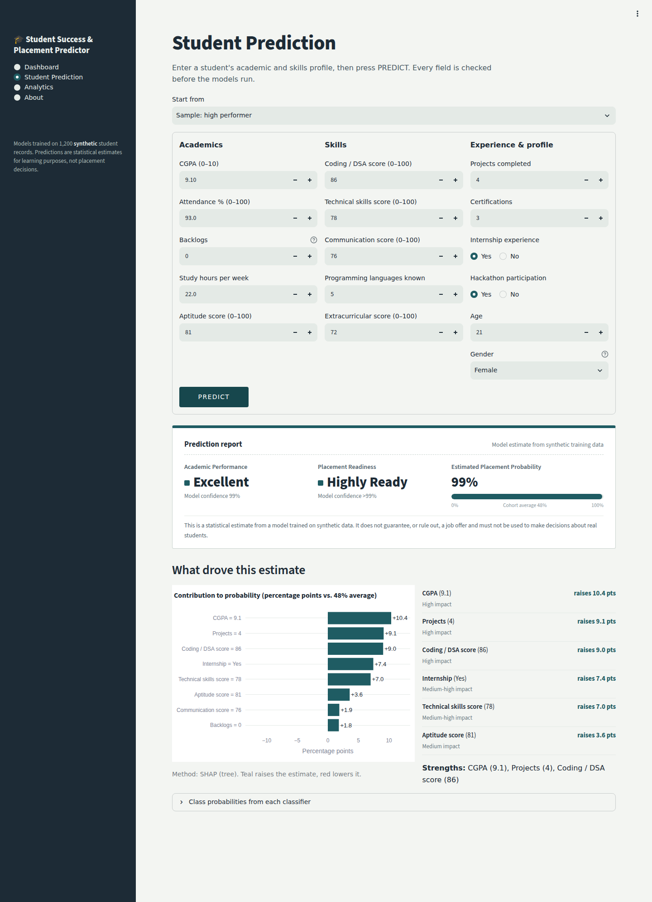
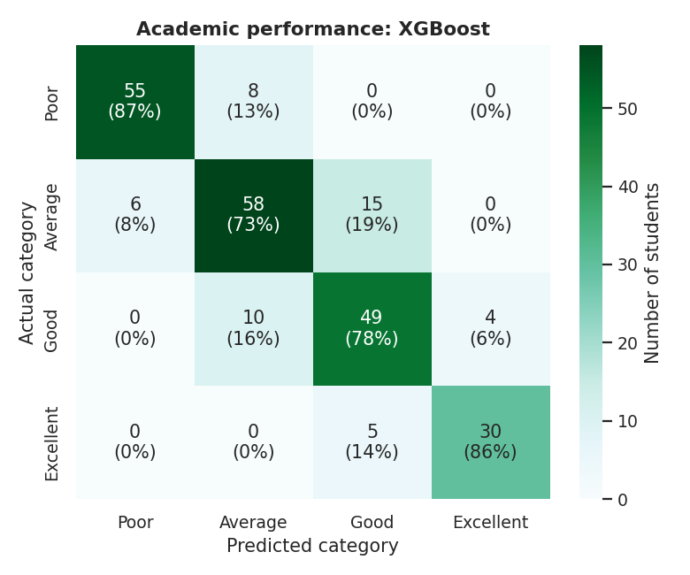
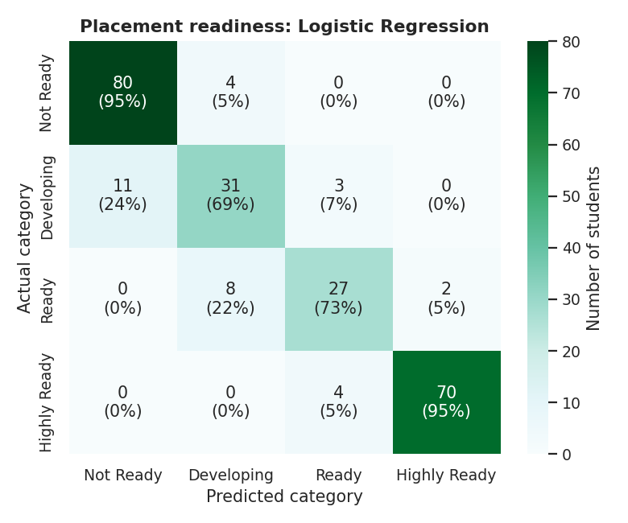
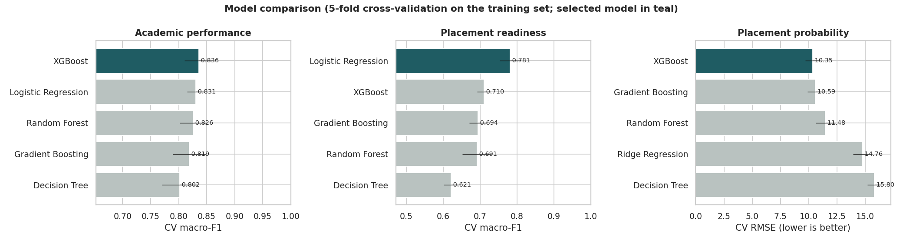
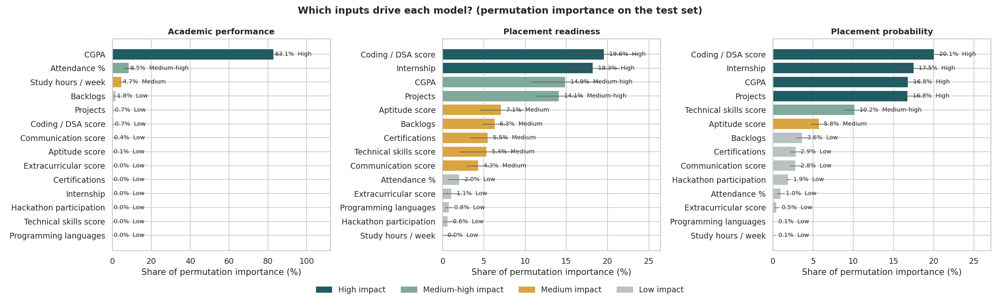

# Student Success & Placement Predictor

A machine-learning mini project (B.Tech CSE / AI & ML, 3rd year) that analyses a student's academic and
extracurricular profile and estimates **academic performance**, **placement readiness** and **placement
probability**, with an explanation of which factors drove each estimate.

> **⚠️ Synthetic data.** All 1,200 student records are simulated by `src/generate_data.py`. The relationships
> between features and outcomes are assumptions written into the generator. The models, metrics and charts
> describe that simulation only. **They are not evidence about real students, and the application cannot
> guarantee — or rule out — anyone getting a job.**



---

## Contents
1. [Problem statement](#1-problem-statement)
2. [Objectives](#2-objectives)
3. [Features](#3-features)
4. [Technology stack](#4-technology-stack)
5. [Dataset](#5-dataset)
6. [Installation](#6-installation)
7. [Training the models](#7-training-the-models)
8. [Running the app](#8-running-the-streamlit-app)
9. [Example prediction](#9-example-prediction)
10. [Methodology](#10-methodology)
11. [Model evaluation](#11-model-evaluation)
12. [Explainability](#12-explainability)
13. [Testing](#13-testing)
14. [Project structure](#14-project-structure)
15. [Limitations](#15-limitations)
16. [Ethical considerations](#16-ethical-considerations)
17. [Future scope](#17-future-scope)

---

## 1. Problem statement
Training & placement cells and faculty mentors often only discover in the final year that a student is not
prepared for campus recruitment, when there is little time left to act. Academic records, coding practice,
projects and internships are scattered across different places. A tool that combines them into an early,
explainable estimate — and says *which* factors matter most — can help mentors decide where to focus support.

## 2. Objectives
- Build a reproducible preprocessing and training pipeline free of data leakage.
- Predict three outputs: academic-performance category (4 classes), placement-readiness category (4 classes)
  and placement probability (0–100 %).
- Compare five algorithms per task and select the final model using documented cross-validation results.
- Explain predictions globally (feature importance) and per student (SHAP).
- Deliver a clean Streamlit interface with input validation.
- State the limits of a model trained on synthetic data clearly.

## 3. Features
- **Dashboard** — dataset size, average CGPA / attendance / coding score, readiness and performance distributions.
- **Student Prediction** — 16-field form, sample profiles, a prominent **PREDICT** button, a prediction report with
  all three outputs, a SHAP chart of the factors that raised or lowered the estimate, strengths / areas to work on,
  and the class probabilities of each classifier.
- **Analytics** — interactive Plotly charts (CGPA distribution, attendance vs CGPA, coding score / projects /
  internship / certifications vs readiness), feature importance for each model, model-comparison tables,
  confusion matrices and regression diagnostics.
- **About** — objective, dataset, algorithms, technologies, limitations and ethics.
- **Validation** — every field is range-checked with a specific error message (e.g. *"CGPA must be between 0 and 10
  (you entered 11.5)"*).

## 4. Technology stack
| Purpose | Tools |
|---|---|
| Language | Python 3.11+ |
| Data | pandas, NumPy |
| Machine learning | scikit-learn (Pipeline, ColumnTransformer), XGBoost |
| Explainability | SHAP, scikit-learn permutation importance |
| Visualisation | Matplotlib, Seaborn (notebooks/reports), Plotly (interactive app charts) |
| Model persistence | joblib |
| Web app | Streamlit |
| Experimentation | Jupyter Notebook |
| Testing | pytest, `streamlit.testing.AppTest` |

## 5. Dataset
`data/student_dataset.csv` — **1,215 raw rows** (1,200 unique students + 15 injected duplicates), 20 columns.

| Column | Type | Range / values |
|---|---|---|
| student_id | ID | STU00001 … (not used for modelling) |
| age, gender | demographic | 19–24; Male / Female / Other (**not used for modelling**) |
| cgpa | float | 0–10 |
| attendance_pct | float | 0–100 |
| backlogs | int | ≥ 0 |
| coding_score, aptitude_score, communication_score, extracurricular_score, technical_skills_score | int | 0–100 |
| projects, certifications, programming_languages | int | ≥ 0 |
| internship, hackathon | categorical | Yes / No |
| study_hours_per_week | float | 0–100 |
| **academic_performance** | target | Poor / Average / Good / Excellent |
| **placement_readiness** | target | Not Ready / Developing / Ready / Highly Ready |
| **placement_probability** | target | 0–100 % |

**How it was generated.** Each simulated student has two hidden traits (*ability*, *diligence*). Observable
features are noisy functions of them, so they correlate realistically. The academic index (driven mainly by CGPA,
attendance and backlogs) and the placement score (coding, aptitude, communication, technical skills, CGPA,
projects, certifications, internship, hackathons, backlogs) are computed with added noise and then binned into
categories; the probability is a logistic transform of the placement score plus noise.

**Deliberate data-quality problems** for the pipeline to handle: ~2 % missing values in six columns, 15 duplicate
rows and 6 impossible values (CGPA 12.4 and −1, attendance 134 % and 250 %, coding score −8, 160 study hours/week).

Regenerate with `python -m src.generate_data` (fixed seed 42, so the file is identical every time).

## 6. Installation
```bash
git clone <your-repo-url> student-success-placement-predictor
cd student-success-placement-predictor

python -m venv .venv
# Windows:  .venv\Scripts\activate
# macOS / Linux:
source .venv/bin/activate

pip install -r requirements.txt
```
The trained models are already included in `models/`. If you install a different scikit-learn or XGBoost
version than the pinned one, retrain (next step) so the `.pkl` files match your versions.

## 7. Training the models
```bash
python -m src.generate_data     # optional – recreates data/student_dataset.csv
python -m src.train             # cleans, trains, compares, evaluates, saves everything
```
Training takes about a minute on a laptop and writes:
- `models/` — `academic_model.pkl`, `placement_model.pkl`, `probability_model.pkl`,
  `preprocessing_pipeline.pkl`, `shap_background.pkl`, `model_metadata.json`
- `outputs/metrics/` — comparison tables, feature importance, fairness audit, final test metrics
- `outputs/figures/` — confusion matrices, feature importance, SHAP plots, regression plots
- `outputs/reports/` — cleaning report, classification reports, `training_summary.md`

The same steps, with commentary, are in `notebooks/01_data_generation.ipynb`, `02_eda.ipynb` and
`03_model_training.ipynb` (open with `jupyter notebook`).

## 8. Running the Streamlit app
```bash
streamlit run app.py
```
Then open http://localhost:8501. Use the **Start from** menu to load a sample profile, edit any field and press
**PREDICT**.

## 9. Example prediction
From the Python API (`python -m src.predict` runs a demo):
```python
from src.predict import StudentPredictor
p = StudentPredictor()
res = p.predict({
    "age": 20, "gender": "Male", "cgpa": 7.1, "attendance_pct": 79, "backlogs": 0,
    "coding_score": 58, "aptitude_score": 60, "communication_score": 63, "projects": 2,
    "certifications": 1, "internship": "No", "hackathon": "No", "extracurricular_score": 55,
    "technical_skills_score": 47, "programming_languages": 2, "study_hours_per_week": 13,
})
print(res.summary())
```
Output (the "average student" sample):
```
Academic Performance      : Average (51% model confidence)
Placement Readiness       : Developing (66% model confidence)
Estimated Placement Prob. : 45%
Main factors (SHAP (tree), vs. average student at 48%):
  CGPA                     =    7.1    +7.7 pts
  Internship               =     No    -6.2 pts
  Technical skills score   =     47    -5.1 pts
  Backlogs                 =      0    +2.3 pts
  Projects                 =      2    +2.1 pts
  Communication score      =     63    -2.1 pts
```
Read this as: *compared with the average student in the training data (48 %), this student's CGPA pushes the
estimate up, while having no internship and a below-average technical-skills score pull it down.*

## 10. Methodology

### 10.1 Preprocessing (leakage-safe)
| Step | Where | What |
|---|---|---|
| Duplicate removal | before split | exact duplicate rows dropped (15) |
| Impossible values | before split | values outside the valid domain → NaN (rule-based, learns nothing from data) |
| Outlier detection | before split | IQR report in `outputs/metrics/iqr_outlier_report.csv`; in-domain outliers are real students and are kept |
| Train/test split | — | 80 / 20, stratified by placement readiness, `random_state=42` |
| Missing values | inside Pipeline | median (numeric), most-frequent (Yes/No) — fitted on training folds only |
| Scaling | inside Pipeline | `StandardScaler` on numeric features |
| Encoding | inside Pipeline | `OneHotEncoder(drop="if_binary")` for internship / hackathon |
| Feature selection | inside Pipeline | `VarianceThreshold`; plus exclusion of ID, age and gender by design |

Because every learned step lives inside `Pipeline(preprocess → model)`, `cross_validate` re-fits it in each
fold, and the test set is never seen during training or selection.

### 10.2 Models compared
| Task | Candidates |
|---|---|
| Academic performance (4 classes) | Logistic Regression, Decision Tree, Random Forest, Gradient Boosting, XGBoost |
| Placement readiness (4 classes) | Logistic Regression, Decision Tree, Random Forest, Gradient Boosting, XGBoost |
| Placement probability (regression, 0–100) | Ridge Regression, Decision Tree, Random Forest, Gradient Boosting, XGBoost |

**Selection rule (documented, not preference):** highest mean 5-fold stratified CV **macro-F1** on the training
set for classifiers (macro-F1 treats the small *Excellent* / *Ready* classes as equally important); lowest mean
5-fold CV **RMSE** for the regressor. Regression outputs are clipped to 1–99 % in the app because the model never
has grounds for absolute certainty.

## 11. Model evaluation
Test set = 240 held-out students. Full tables: `outputs/reports/training_summary.md`.

**Academic performance — selected: XGBoost**

| Model | CV macro-F1 | Test accuracy | Precision | Recall | Macro-F1 | ROC-AUC |
|---|---|---|---|---|---|---|
| **XGBoost** | **0.836** | 0.800 | 0.814 | 0.811 | 0.812 | 0.959 |
| Logistic Regression | 0.831 | 0.817 | 0.829 | 0.821 | 0.824 | 0.967 |
| Random Forest | 0.826 | 0.783 | 0.810 | 0.788 | 0.797 | 0.953 |
| Gradient Boosting | 0.819 | 0.787 | 0.804 | 0.797 | 0.799 | 0.958 |
| Decision Tree | 0.802 | 0.767 | 0.797 | 0.777 | 0.786 | 0.934 |

**Placement readiness — selected: Logistic Regression**

| Model | CV macro-F1 | Test accuracy | Precision | Recall | Macro-F1 | ROC-AUC |
|---|---|---|---|---|---|---|
| **Logistic Regression** | **0.781** | 0.867 | 0.842 | 0.829 | 0.835 | 0.975 |
| XGBoost | 0.710 | 0.796 | 0.755 | 0.757 | 0.754 | 0.947 |
| Gradient Boosting | 0.694 | 0.771 | 0.719 | 0.721 | 0.719 | 0.943 |
| Random Forest | 0.691 | 0.804 | 0.757 | 0.750 | 0.751 | 0.945 |
| Decision Tree | 0.621 | 0.713 | 0.658 | 0.651 | 0.651 | 0.882 |

**Placement probability — selected: XGBoost**

| Model | CV RMSE | Test MAE | Test RMSE | Test R² |
|---|---|---|---|---|
| **XGBoost** | **10.35** | 7.07 | 9.87 | 0.930 |
| Gradient Boosting | 10.59 | 7.40 | 10.39 | 0.923 |
| Random Forest | 11.48 | 7.95 | 11.21 | 0.910 |
| Ridge Regression | 14.76 | 10.01 | 12.78 | 0.883 |
| Decision Tree | 15.80 | 9.98 | 14.67 | 0.846 |

**Interpreting the results**
- For academic performance, XGBoost and Logistic Regression are within one CV standard deviation of each other
  (±0.02). XGBoost is selected because the rule says so; Logistic Regression scoring slightly higher on the test
  set is normal sampling variation, and choosing by test score would leak the test set into model selection.
- For readiness, Logistic Regression wins clearly: the synthetic placement score is close to a linear function
  of the inputs, which suits a linear model; tree ensembles need more data to approximate smooth boundaries.
- For probability, the logistic "S-curve" makes the target non-linear, where boosted trees do best.
- Almost all classification errors fall between **adjacent** categories (e.g. Developing ↔ Ready) — see
  `outputs/figures/confusion_matrix_*.png`.

| Confusion matrix — academic | Confusion matrix — readiness |
|---|---|
|  |  |



## 12. Explainability
**Global — permutation importance** (drop in test performance when one feature is shuffled):

| Placement readiness | Impact | Placement probability | Impact |
|---|---|---|---|
| Coding / DSA score | High (19.6 %) | Coding / DSA score | High (20.1 %) |
| Internship | High (18.3 %) | Internship | High (17.5 %) |
| CGPA | Medium-high (14.9 %) | CGPA | High (16.8 %) |
| Projects | Medium-high (14.1 %) | Projects | High (16.8 %) |
| Aptitude score | Medium (7.1 %) | Technical skills score | Medium-high (10.2 %) |
| Backlogs | Medium (6.3 %) | Aptitude score | Medium (5.8 %) |

Academic performance is dominated by CGPA (83 %), then attendance (8.5 %) and study hours (4.7 %).



**Per student — SHAP.** The app computes SHAP values (`TreeExplainer` for tree models, `LinearExplainer` for
linear ones) for each prediction and shows how many percentage points each input added to or removed from the
cohort-average probability. SHAP summary plots are in `outputs/figures/shap_summary_*.png`.

Importance shows what the *model relies on*, not what *causes* placement.

## 13. Testing
```bash
pytest -v tests/                 # 15 automated tests (12 prediction cases + 3 app smoke tests)
python -m tests.test_cases       # writes outputs/reports/test_cases_report.md
```

| ID | Scenario | Expected | Actual | Result |
|---|---|---|---|---|
| TC01 | High-performing student | Good/Excellent; Ready/Highly Ready; ≥ 70 % | Excellent / Highly Ready / 99 % | PASS |
| TC02 | Average-performing student | Average/Good; Developing/Ready; 20–70 % | Average / Developing / 45 % | PASS |
| TC03 | Low-performing student | Poor; Not Ready; < 20 % | Poor / Not Ready / 1 % | PASS |
| TC04 | Multiple backlogs (5) | Poor/Average; lower probability than 0 backlogs; backlogs negative | Average / Not Ready / 36 %; backlogs −6.7 pts | PASS |
| TC05 | Excellent coding score (95) | Higher probability than average; coding in top-3 positive factors | Average / Ready / 59 %; coding +15.9 pts | PASS |
| TC06 | Poor attendance (45 %) | Poor/Average; attendance negative | Average / Developing / 40 % | PASS |
| TC07 | With internship | Higher probability than identical student without | Average / Ready / 70 %; internship +14.9 pts | PASS |
| TC08 | Without internship | Valid result; internship negative | Average / Developing / 45 %; internship −6.2 pts | PASS |
| TC09 | Invalid CGPA (11.0) | Rejected with CGPA range message | "CGPA must be between 0 and 10 (you entered 11)." | PASS |
| TC10 | Invalid attendance (105) | Rejected with attendance range message | "Attendance % must be between 0 and 100 (you entered 105)." | PASS |
| TC11 | Negative backlogs and projects | Two "cannot be negative" messages | Both reported | PASS |
| TC12 | Gender changed only | Identical predictions | Identical | PASS |

App smoke tests check that every page renders without exceptions, that PREDICT produces a report, and that
invalid CGPA/attendance show error messages instead of a prediction.

## 14. Project structure
```
student-success-placement-predictor/
├── app.py                         Streamlit application
├── requirements.txt
├── README.md
├── LICENSE                        MIT
├── .streamlit/config.toml         theme
├── data/
│   └── student_dataset.csv        synthetic raw data (1,215 rows)
├── notebooks/
│   ├── 01_data_generation.ipynb
│   ├── 02_eda.ipynb
│   └── 03_model_training.ipynb
├── src/
│   ├── generate_data.py           synthetic data generator
│   ├── preprocessing.py           cleaning, outlier report, ColumnTransformer pipeline
│   ├── train.py                   CV comparison, selection, evaluation, explainability, export
│   ├── predict.py                 StudentPredictor with SHAP explanations
│   └── utils.py                   paths, constants, input validation
├── models/                        trained pipelines + metadata
├── outputs/
│   ├── figures/                   EDA, confusion matrices, importance, SHAP, regression
│   ├── metrics/                   CSV/JSON metrics, fairness audit
│   └── reports/                   training summary, classification & test reports
├── screenshots/                   real screenshots of the running app
└── tests/
    ├── test_cases.py              12 prediction/validation cases
    └── test_app.py                Streamlit AppTest smoke tests
```

## 15. Limitations
- **Synthetic data.** The models can only rediscover the rules written into the generator; high scores mean
  "the simulator is learnable", not "placements are predictable".
- **Three independent models.** For borderline students the readiness category and the probability can look
  slightly inconsistent (e.g. *Developing* at 55 %).
- **Simplified inputs.** A single "communication score" or "technical skills score" cannot capture real
  interview performance, domain fit, company requirements, job-market conditions or luck.
- **Small test set.** 240 students; the *Other* gender group in the fairness audit has only 6 students.
- **No temporal validation.** Real use would need testing on a later batch of students than the one trained on.

## 16. Ethical considerations
- Age and gender are **not model inputs**; `outputs/metrics/fairness_by_gender.csv` audits outcomes across
  gender groups, because excluding an attribute does not by itself rule out proxy bias.
- The output is an estimate to prompt **support** (mentoring, practice, project guidance), never to rank,
  filter or deny opportunities.
- Every prediction screen carries a visible disclaimer that the model cannot guarantee job outcomes.
- Using real student data would require informed consent, anonymisation, secure storage, and review by the
  institution.

## 17. Future scope
- Train and validate on real, consented, anonymised institutional data (with a later batch as the test set).
- A single multi-output or ordinal model so the three outputs are consistent by construction.
- Probability calibration and prediction intervals.
- "What-if" planner: show how the estimate changes if the student completes an internship or two more projects.
- Batch upload (CSV) for mentors, with privacy controls.
- Deployment on Streamlit Community Cloud or Docker.

---
*Academic project. The model is a learning exercise on simulated data and must not be used to make decisions
about real students.*
